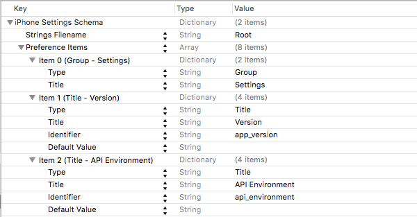
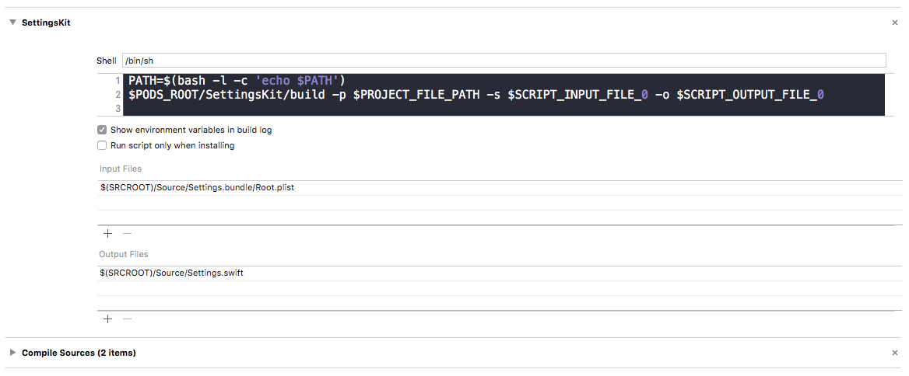

# SettingsKit

[](https://travis-ci.org/dtrenz/SettingsKit)
[](http://cocoapods.org/pods/SettingsKit)
[](http://cocoapods.org/pods/SettingsKit)
[](http://cocoapods.org/pods/SettingsKit)
[](http://www.detroitlabs.com)

`SettingsKit` is a small library & build tool simplifies reading & writing items
in the iOS Settings app. It also makes working with app settings a bit safer by
using enums instead of magic strings that could accidentally be typo-ed.


## When would I want to use SettingKit?

Here are just a few ways you could use SettingsKit;
 - display the current app version & build number to users or testers, which can
 be very helpful for handling bug reports.
 - give users simple controls for app preferences (e.g. enable a color blindness theme)
 - enable testers to see which back-end environment (i.e. "Staging") the current
 build is using, and also allow them to change the back-end environment at runtime,
 without having to provide seperate builds for each environment.

The types of settings you use are completely up to you. `SettingsKit` simply
makes it easier to add settings to your app.


## Usage

### Fetch a setting

```swift
let name = Settings.get(.FirstName)
```

### Modify a setting

```swift
Settings.set(.ApiEnvironment, "Staging")
Settings.set(.Contrast, 80)
Settings.set(.EnableAnalytics, true)
```

### Observe a setting

```swift
// observe and respond to any changes made to a given setting
Settings.subscribe(.FavoriteColor) { (newValue) -> Void in
  print("Favorite color was changed to \(newValue)")
}
```


## Installation

`SettingsKit` is available through [CocoaPods](http://cocoapods.org). To install
it, simply add the following line to your Podfile:

```ruby
pod "SettingsKit"
```

You will also need the `xcodeproj` ruby gem in order to use the `SettingsKit`
build tool to auto-generate the Settings.swift file.

```bash
$ gem install xcodeproj
```


## Setup

### Create a Settings bundle
In order to add custom items to Settings your app must have a Settings bundle
with a `Root.plist`. To fetch, update, and/or observe settings you will need to
add the settings you would like to use to the "Preference Items" array in your
`Settings.bundle/Root.plist`.

> Example:
>
> 

Once you have added one or more preference items, build your project to have
`SettingsKit` generate a `Settings.swift` file from your `Settings.bundle/Root.plist`.

> **Important** — Anytime you change the preference items in your `Root.plist`
you will need build your project to generate an updated `Settings.swift` file.

### Add a run script build phase
To allow `SettingsKit` to auto-generate a Settings enum file you will need to
add a run script build phase to your app's target: Target > Build Phases > "+" > "New Run Script Phase"

**IMPORTANT** Make sure you put the new run script phase above the "Compile Sources"
phase.

**Step 1:** Copy/paste the following into the script box:

```bash
PATH=$(bash -l -c 'echo $PATH')
$PODS_ROOT/SettingsKit/build -p $PROJECT_FILE_PATH -s $SCRIPT_INPUT_FILE_0 -o $SCRIPT_OUTPUT_FILE_0
```

**Step 2:** Add the path to your `Settings.bundle/Root.plist` to "Input Files".

> Example:
>
> 

**Step 3:** Add the path to where you would like the generated `Settings.swift`
file to be live (i.e. where you put your app's source files).

> Example:
>
> 

When you are done with all of the above steps, your `SettingsKit` run script
phase should look something like this:



Finally, build (⌘B) your project. If the project builds successfully, you should
now see a new `Settings.swift` file in your project. Feel free to move it to any
group in your project.

From now on, everytime you build, `SettingsKit` will update the `Settings.swift`
file to match the Preference Items you have configured in your
`Settings.bundle/Root.plist`. You should never need to manually edit `Settings.swift`.


## Author

Dan Trenz ([@dtrenz](http://www.twitter.com/dtrenz)) c/o [Detroit Labs](http://www.detroitlabs.com)


## License

SettingsKit is available under the Apache License, Version 2.0. See the LICENSE file for more info.
